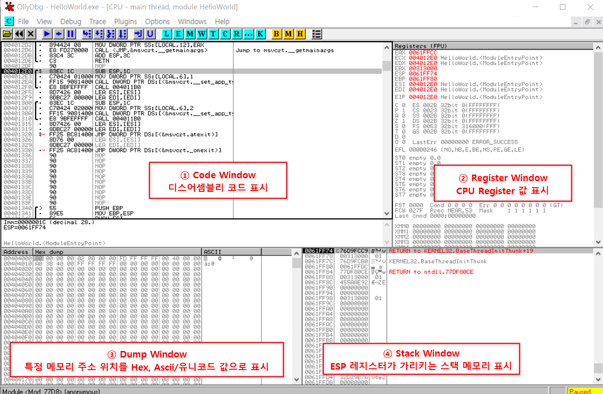
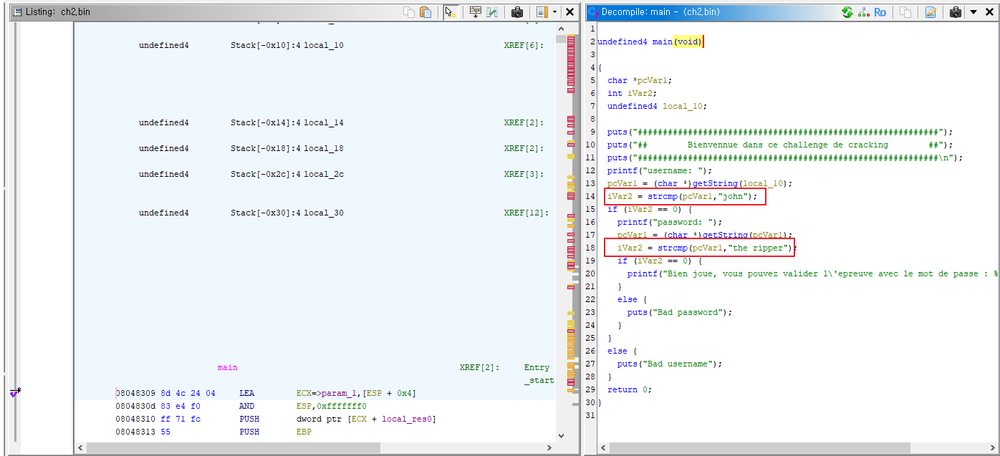

# WEEK 1

- [ ]  드림핵 기드라 과정
- [ ]  도서 ‘리버싱 핵심원리’ 2~5강 (실습예제 포함)
- [ ]  문제풀이 과제

<br>

# 리버싱 핵심원리

## 올리 디버거 view



<br>

## 원하는 코드를 빨리 찾아내는 방법

**1\. 코드 실행 방법**
- 명령어를 실행해가며 기능이 동작하는 부분을 찾아가는 것.
- 코드 크기가 작고 기능 명확한 경우에 사용함
  

**2\. 문자열 검색**
- 우클릭 > Search for > All referenced text string

**3\. API 검색(1) - 호출 코드에 BP**
- 사용되는 API 함수 목록 확인: 우클릭 > Search for > All intermodular calls
- 그러나 모든 실행파일에 대해 API 함수 호출 목록을 추출할 수 있는건 아님. 
  Packer/Protector를 통해 실행파일을 압축하면 파일구조가 변경되어 확인불가능

> \* **Pckaer**: 실행 압축 유틸리티로, 실행 파일의 코드/데이터/리소스 등을 압축시킴.  
> \* **Protector**: 실행 압축 기능 + 안티디버깅, 안티에뮬레이팅, 안티덤프 등의 기능을 추가한 유틸리티.  
	→ 프로세스 메모리에 로딩된 라이브러리에 직접 BP를 걸어봄으로서 확인(방법 4)

**4\. API 검색(1) - API 코드에 직접 BP**
- 우클릭 > Search for > Name in all modules > Name 열에서 API명 타이핑
- 더블클릭 시 해당 API 위치로 이동됨

<br>

## 문자열 패치
1\. 문자열 버퍼를 직접 수정
- Dump Window > 문자열 주소로 이동 > 문자열 선택 후 Ctrl+E
- 간단하나, 기존 문자열 버퍼 크기 이상의 문자를 입력하기 어려움

    ※ 원본 문자열 길이를 넘어가는 문자열을 덮어쓰는 것은 위험한. 의미있는 데이터가 존재할 수 있기 때문임. 

> [+] 패치한 파일을 별도 파일로 저장하는 방법
> 
> dump window에서 변경된 내용 선택 후 ['우클릭' > 'Copy to executable file' > 우클릭 > Save file] 


2\. 다른 메모리 영역에 새로운 문자열 생성후 전달


<br>
<br>
<br>

# 문제풀이 과제
- [ ] picoCTF - "Assembly-0" : 간단한 x86 어셈블리 코드를 읽고 이해하는 문제
https://play.picoctf.org/practice/challenge/160?originalEvent=34&page=1&search=arm
-  [x] Root Me - "ELF x86 - Basic" : ELF 파일 구조와 기본적인 리버싱 기술을 테스트
https://www.root-me.org/en/Challenges/Cracking/ELF-x86-Basic
- [ ] Reversing.Kr - "Easy Crackme" :
- [ ] CTFlearn - "Simple bof" : 스택의 동작을 이해하고 간단한 버퍼 오버플로우를 익히는 문제
https://ctflearn.com/challenge/1010
- [ ] http://reversing.kr/challenge.php
- [ ] HackThisSite - "Realistic 2" : 간단한 리버싱 문제로, 문자열 패치와 관련https://www.hackthissite.org/missions/realistic/2/
- [ ] pwnable.kr - "fd" : 파일 디스크립터와 리눅스 시스템 콜을 이해하는 간단한 문제
https://pwnable.kr/play.php
- [ ] OverTheWire - "Narnia0" : 버퍼 오버플로우의 기초를 다루는 문제로, 스택의 동작을 이해
https://overthewire.org/wargames/narnia/
- [ ] Exploit Exercises - "Protostar Stack0" : 스택의 동작과 메모리 레이아웃을 이해하는 문제
https://exploit.education/protostar/

## 2. Root Me - "ELF x86 - Basic"


## 3. Reversing.Kr - "Easy Crackme"

```
void FUN_00401080(HWND param_1)

{
  byte bVar1;
  byte *pbVar2;
  int iVar3;
  char *pcVar4;
  undefined4 *puVar5;
  bool bVar6;
  char local_64;
  char local_63;
  char cStack_62;
  byte abStack_61 [97];
  
  local_64 = '\0';
  puVar5 = (undefined4 *)&local_63;
  for (iVar3 = 0x18; iVar3 != 0; iVar3 = iVar3 + -1) {
    *puVar5 = 0;
    puVar5 = puVar5 + 1;
  }
  *(undefined2 *)puVar5 = 0;
  *(undefined *)((int)puVar5 + 2) = 0;
  GetDlgItemTextA(param_1,1000,&local_64,100);
  if (local_63 == 'a') {
    iVar3 = _strncmp(&local_63 + 1,&DAT_00406078,2);
    if (iVar3 == 0) {
      pcVar4 = s_AGR3versing_0040606a;
      pbVar2 = (byte *)(&local_63 + 3);
      do {
        pcVar4 = (char *)((byte *)pcVar4 + 2);
        bVar1 = *pbVar2;
        bVar6 = bVar1 < (byte)*pcVar4;
        if (bVar1 != *pcVar4) {
LAB_00401102:
          iVar3 = (1 - (uint)bVar6) - (uint)(bVar6 != 0);
          goto LAB_00401107;
        }
        if (bVar1 == 0) break;
        bVar1 = pbVar2[1];
        bVar6 = bVar1 < ((byte *)pcVar4)[1];
        if (bVar1 != ((byte *)pcVar4)[1]) goto LAB_00401102;
        pbVar2 = pbVar2 + 2;
      } while (bVar1 != 0);
      iVar3 = 0;
LAB_00401107:
      if ((iVar3 == 0) && (local_64 == 'E')) {
        MessageBoxA(param_1,s_Congratulation_!!_00406044,s_EasyCrackMe_00406058,0x40);
        EndDialog(param_1,0);
        return;
      }
    }
  }
  MessageBoxA(param_1,s_Incorrect_Password_00406030,s_EasyCrackMe_00406058,0x10);
  return;
}
```

### 설명

**117행:** `GetDlgItemTextA(param_1,1000,&local_64,100);` 
- 대화상자에서 텍스트를 가져오는 API
- 대화상자 param_1의 컨트롤id가 1000인 곳에서 100byte 문자를 가져와 local_64의 주소에 저장함
- local_64는 1byte공간을 차지하고 있음
- 대화상자에서 HelloWorld 입력시, local_64부터 한글자씩 저장됨

```stack
local_64 : H  
local_63 : e  
cStack_62 : l  
abStack_61[0] : l  
abStack_61[1] : o  
abStack_61[2] : W  
abStack_61[3] : o  
abStack_61[4] : r  
abStack_61[5] : l   
abStack_61[6] : d 
```

<br>

**118~119행**
```  
if (local_63 == 'a') {
    iVar3 = _strncmp(&local_63 + 1,&DAT_00406078,2);
```
두번째 글자가 a이면, local_63 주소값 + 1에 있는 값과 DAT_00406078 위치에 있는 값과 2byte 만큼 비교한다. DAT_00406078는 `5y`

→ 추측 가능한 정답: ?a5y?


120~121행
```
    if (iVar3 == 0) {
      pcVar4 = s_AGR3versing_0040606a;
```
iVar3은 119행에서 strncmp의 반환값이 저장됨. true면 0이다.
pcVar4에 s_AGR3versing_0040606a를 저장한다. s_AGR3versing_0040606a는 `AGR3versing`


나머지는 내일 출근하고 마저 작성하자