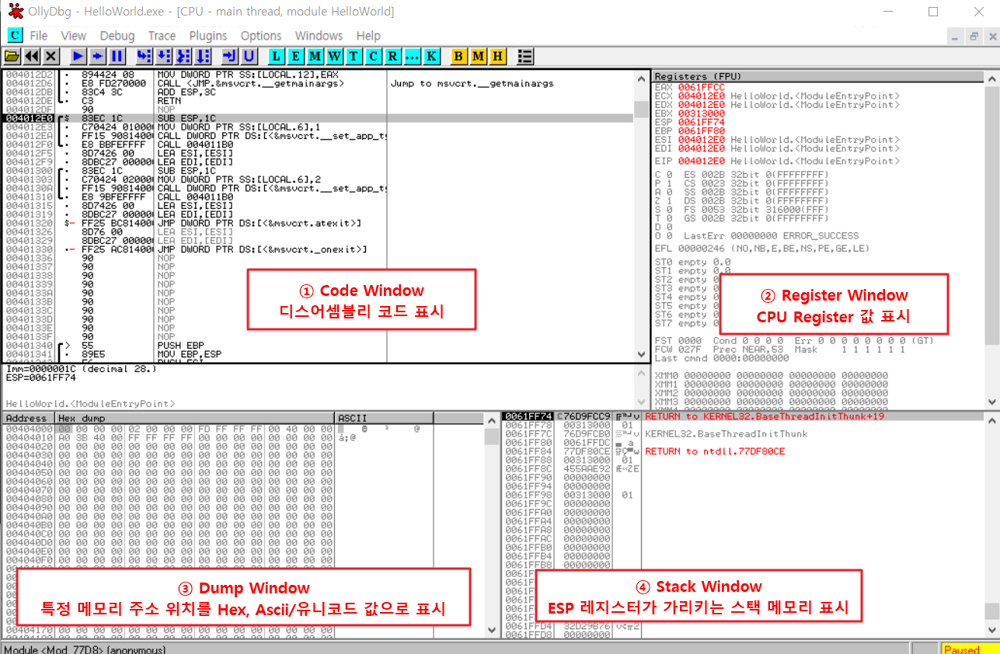
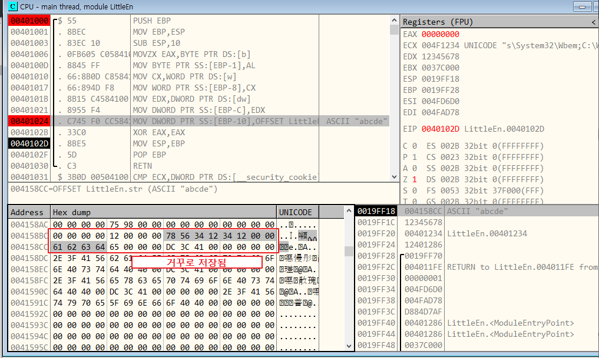
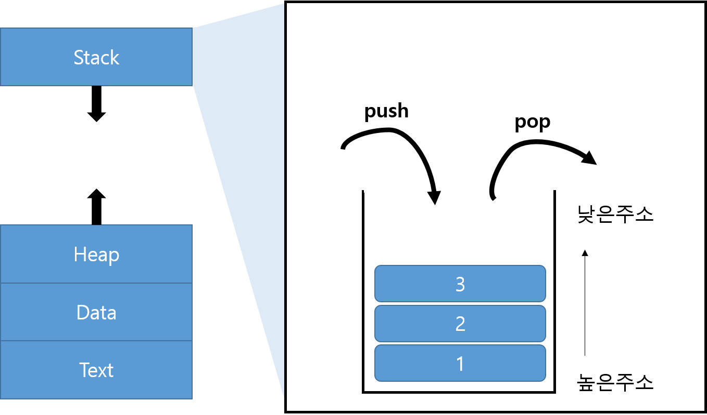
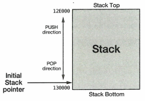

# WEEK 1

- [x]  드림핵 기드라 과정
  - 코드 브라우저 1~2
- [x]  도서 ‘리버싱 핵심원리’ 2~5강 (실습예제 포함)
- [x]  문제풀이 과제
  - 일부 문제 제외

 

# 리버싱 핵심원리

## 올리 디버거 view

 

## 원하는 코드를 빨리 찾아내는 방법

**1\. 코드 실행 방법**
- 명령어를 실행해가며 기능이 동작하는 부분을 찾아가는 것.
- 코드 크기가 작고 기능 명확한 경우에 사용함
  

**2\. 문자열 검색**
- 우클릭 > Search for > All referenced text string

**3\. API 검색(1) - 호출 코드에 BP**
- 사용되는 API 함수 목록 확인: 우클릭 > Search for > All intermodular calls
- 그러나 모든 실행파일에 대해 API 함수 호출 목록을 추출할 수 있는건 아님. 
  Packer/Protector를 통해 실행파일을 압축하면 파일구조가 변경되어 확인불가능

> \* **Packer**: 실행 압축 유틸리티로, 실행 파일의 코드/데이터/리소스 등을 압축시킴.  
> \* **Protector**: 실행 압축 기능 + 안티디버깅, 안티에뮬레이팅, 안티덤프 등의 기능을 추가한 유틸리티.  
	→ 프로세스 메모리에 로딩된 라이브러리에 직접 BP를 걸어봄으로서 확인(방법 4)

**4\. API 검색(1) - API 코드에 직접 BP**
- 우클릭 > Search for > Name in all modules > Name 열에서 API명 타이핑
- 더블클릭 시 해당 API 위치로 이동됨

 

## 문자열 패치
**1\. 문자열 버퍼를 직접 수정**
- Dump Window > 문자열 주소로 이동 > 문자열 선택 후 Ctrl+E
- 간단하나, 기존 문자열 버퍼 크기 이상의 문자를 입력하기 어려움

    ※ 원본 문자열 길이를 넘어가는 문자열을 덮어쓰는 것은 위험한. 의미있는 데이터가 존재할 수 있기 때문임. 

> **※ 패치한 파일을 별도 파일로 저장하는 방법**  
> dump window에서 변경된 내용 선택 후 ['우클릭' > 'Copy to executable file' > 우클릭 > Save file] 

**2\. 다른 메모리 영역에 새로운 문자열 생성후 전달**
- 임의의 공간(Dump Window)의 NULL Padding 영역에 새로운 문자열 생성
- Code Window의 assemble 명령(space)을 통해 새 문자열을 생성한 주소 전달 

 

## 바이트 오더링
메모리에 데이터를 저장하는 방식.  
- 빅 엔디언: 데이터 저장 시 순차적으로 저장
- 리틀 엔디언: 데이터 저장 시 역순으로 저장

 

## IA-32 레지스터
### 범용 레지스터

- EAX: 산술/논리연산 시 사용. 일반적으로 함수 반환 값이 저장  
- EDX: 연산 시 EAX와 같이 사용됨  
- EBX: 메모리 주소를 저장  
- ECX: 반복문 명령어(LOOP)에서 반복 카운트로 사용. 루프를 돌 때마다 ECX를 1씩 감소  
- EBP: 스택의 최하단 주소 저장(스택 베이스 주소)  
- ESP: 스택의 최상단 주소 저장(스택 메모리 주소)  
- ESI: 문자열 연산에서 사용되는 soruce 주소 저장  
- EDI: 문자열 연산에서 샤용되는 destination 주소 저장  

> **※ 스택**
> 스택은 높은 주소에서 낮은 주소로 할당되므로, 낮은 주소일수록 최상단의 주소.  
> EBP 레지스터는 항상 현 스택에서 가장 높은 주소값을 가짐. 
> ESP 레지스터는 가장 낮은 주소값을 가짐.

- 우리가 알고있던 스택 이미지는 뒤집힌 모습.

 

### 세그먼트 레지스터
- CS: 코드 세그먼트   
- SS: 스택 세그먼트  
- DS: 데이터 세그먼트  
- ES, FS, GS: 추가적인 데이터 세그먼트  

 

### 플래그 레지스터
**EFLAGS**: CPU 동작 제어, 연산 결과 반영하는 데 사용되는 레지스터. 
애플리케이션 디버깅에 필요한 3가지 플래그가 중요함  
→ 조건 분기 명령어에서 Flag 값을 확인하고 동작 수행 여부를 결정하기 떄문임.  
- ZF: Zero 플래그. 연산 명령 후 결과가 0이 되면 ZF가 1로 세팅.  
- OF: Overflow 플래그. 부호있는 수의 오버플로 발생시 1로 세팅.  
또는 MSB(Most Significant Bit) 변경 시 1로 세팅.  
\*MSB: 최상위 비트를 의미
- CF: Carry 플래그. 부호 없는 수의 오버플로 발생 시 1로 세팅.

 

### Instruction Pointer
= 프로그램 카운터  

**EIP**
CPU가 처리할 명령어의 주소를 나타내는 레지스터. CPU는 EIF에 저자된 메모리 주소의 명렁어를 하나 처리한 후 자동으로 해당 명령어 길이만큼 EIP를 증가.

※EIP 값을 직접 변경 불가능하며, 변경하고 싶다면 특정 명령어(JMP, Jcc, CALL, RET)을 사용하거나 인터럽트, 예외를 발생시키면 됨.

 

## 스택
### 스택의 역할
- 함수 내 지역 변수 임시 저장
- 함수 호출 시 파라미터 전달
- 복귀주소 저장

 

### 스택의 특징

- 프로세스에서 스택 포인터(ESP)의 초기값은 스택 Bottom 쪽.  
- PUSH 명령에 의해 값 추가 시 ESP는 스탁 Top을 향해 움직임  
- 높은 주소에서 낮은 주소 방향으로 스택이 자라남
- 스택에서 값을 PUSH 하면 ESP는 감소하고, 스택에서 값을 POP하면 ESP는 증가  
