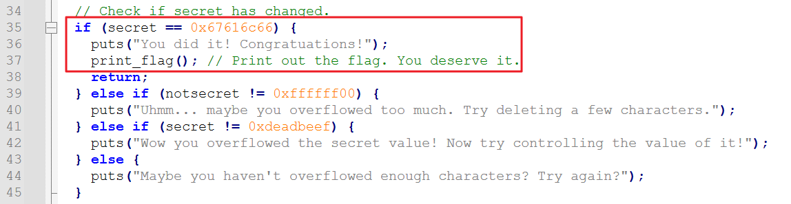
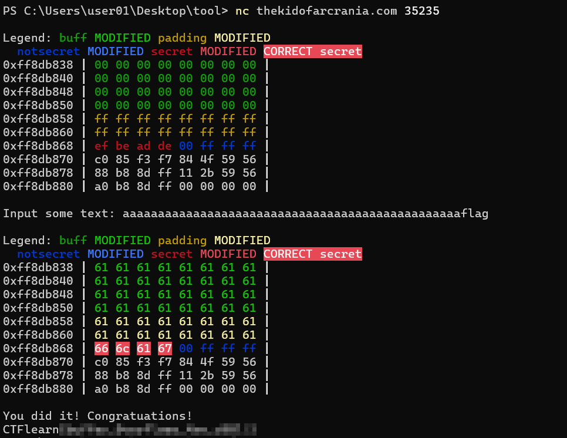
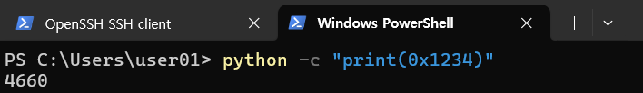

# WEEK 1

- [ ]  드림핵 기드라 과정
- [ ]  도서 ‘리버싱 핵심원리’ 2~5강 (실습예제 포함)
- [ ]  문제풀이 과제

<br>

# 리버싱 핵심원리

## 올리 디버거 view


<br>

## 원하는 코드를 빨리 찾아내는 방법

**1\. 코드 실행 방법**
- 명령어를 실행해가며 기능이 동작하는 부분을 찾아가는 것.
- 코드 크기가 작고 기능 명확한 경우에 사용함
  

**2\. 문자열 검색**
- 우클릭 > Search for > All referenced text string

**3\. API 검색(1) - 호출 코드에 BP**
- 사용되는 API 함수 목록 확인: 우클릭 > Search for > All intermodular calls
- 그러나 모든 실행파일에 대해 API 함수 호출 목록을 추출할 수 있는건 아님. 
  Packer/Protector를 통해 실행파일을 압축하면 파일구조가 변경되어 확인불가능

> \* **Pckaer**: 실행 압축 유틸리티로, 실행 파일의 코드/데이터/리소스 등을 압축시킴.  
> \* **Protector**: 실행 압축 기능 + 안티디버깅, 안티에뮬레이팅, 안티덤프 등의 기능을 추가한 유틸리티.  
	→ 프로세스 메모리에 로딩된 라이브러리에 직접 BP를 걸어봄으로서 확인(방법 4)

**4\. API 검색(1) - API 코드에 직접 BP**
- 우클릭 > Search for > Name in all modules > Name 열에서 API명 타이핑
- 더블클릭 시 해당 API 위치로 이동됨

<br>

## 문자열 패치
1\. 문자열 버퍼를 직접 수정
- Dump Window > 문자열 주소로 이동 > 문자열 선택 후 Ctrl+E
- 간단하나, 기존 문자열 버퍼 크기 이상의 문자를 입력하기 어려움

    ※ 원본 문자열 길이를 넘어가는 문자열을 덮어쓰는 것은 위험한. 의미있는 데이터가 존재할 수 있기 때문임. 

> [+] 패치한 파일을 별도 파일로 저장하는 방법
> 
> dump window에서 변경된 내용 선택 후 ['우클릭' > 'Copy to executable file' > 우클릭 > Save file] 


2\. 다른 메모리 영역에 새로운 문자열 생성후 전달


<br>
<br>
<br>

# 문제풀이 과제
- [ ] picoCTF - "Assembly-0" : 간단한 x86 어셈블리 코드를 읽고 이해하는 문제
https://play.picoctf.org/practice/challenge/160?originalEvent=34&page=1&search=arm
-  [x] Root Me - "ELF x86 - Basic" : ELF 파일 구조와 기본적인 리버싱 기술을 테스트
https://www.root-me.org/en/Challenges/Cracking/ELF-x86-Basic
- [x] Reversing.Kr - "Easy Crackme" http://reversing.kr/challenge.php
- [x] CTFlearn - "Simple bof" : 스택의 동작을 이해하고 간단한 버퍼 오버플로우를 익히는 문제
https://ctflearn.com/challenge/1010
- [x] HackThisSite - "Realistic 2" : 간단한 리버싱 문제로, 문자열 패치와 관련 https://www.hackthissite.org/missions/realistic/2/
- [x] pwnable.kr - "fd" : 파일 디스크립터와 리눅스 시스템 콜을 이해하는 간단한 문제
https://pwnable.kr/play.php
- [ ] OverTheWire - "Narnia0" : 버퍼 오버플로우의 기초를 다루는 문제로, 스택의 동작을 이해
https://overthewire.org/wargames/narnia/
- [ ] Exploit Exercises - "Protostar Stack0" : 스택의 동작과 메모리 레이아웃을 이해하는 문제
https://exploit.education/protostar/

<br><br>

## 2. Root Me - "ELF x86 - Basic"


<br><br>

## 3. Reversing.Kr - "Easy Crackme"

```
void FUN_00401080(HWND param_1)

{
  byte bVar1;
  byte *pbVar2;
  int iVar3;
  char *pcVar4;
  undefined4 *puVar5;
  bool bVar6;
  char local_64;
  char local_63;
  char cStack_62;
  byte abStack_61 [97];
  
  local_64 = '\0';
  puVar5 = (undefined4 *)&local_63;
  for (iVar3 = 0x18; iVar3 != 0; iVar3 = iVar3 + -1) {
    *puVar5 = 0;
    puVar5 = puVar5 + 1;
  }
  *(undefined2 *)puVar5 = 0;
  *(undefined *)((int)puVar5 + 2) = 0;
  GetDlgItemTextA(param_1,1000,&local_64,100);
  if (local_63 == 'a') {
    iVar3 = _strncmp(&local_63 + 1,&DAT_00406078,2);
    if (iVar3 == 0) {
      pcVar4 = s_AGR3versing_0040606a;
      pbVar2 = (byte *)(&local_63 + 3);
      do {
        pcVar4 = (char *)((byte *)pcVar4 + 2);
        bVar1 = *pbVar2;
        bVar6 = bVar1 < (byte)*pcVar4;
        if (bVar1 != *pcVar4) {
LAB_00401102:
          iVar3 = (1 - (uint)bVar6) - (uint)(bVar6 != 0);
          goto LAB_00401107;
        }
        if (bVar1 == 0) break;
        bVar1 = pbVar2[1];
        bVar6 = bVar1 < ((byte *)pcVar4)[1];
        if (bVar1 != ((byte *)pcVar4)[1]) goto LAB_00401102;
        pbVar2 = pbVar2 + 2;
      } while (bVar1 != 0);
      iVar3 = 0;
LAB_00401107:
      if ((iVar3 == 0) && (local_64 == 'E')) {
        MessageBoxA(param_1,s_Congratulation_!!_00406044,s_EasyCrackMe_00406058,0x40);
        EndDialog(param_1,0);
        return;
      }
    }
  }
  MessageBoxA(param_1,s_Incorrect_Password_00406030,s_EasyCrackMe_00406058,0x10);
  return;
}
```

### 설명

**23행**  

`GetDlgItemTextA(param_1,1000,&local_64,100);` 
- 대화상자에서 텍스트를 가져오는 API
- 대화상자 param_1의 컨트롤id가 1000인 곳에서 100byte 문자를 가져와 local_64의 주소에 저장함
- local_64는 1byte공간을 차지하고 있음
- 대화상자에서 HelloWorld 입력시, local_64부터 한글자씩 저장됨

```stack
local_64 : H  
local_63 : e  
cStack_62 : l  
abStack_61[0] : l  
abStack_61[1] : o  
abStack_61[2] : W  
abStack_61[3] : o  
abStack_61[4] : r  
abStack_61[5] : l   
abStack_61[6] : d 
```

<br>

**24~25행**

```  
if (local_63 == 'a') {
    iVar3 = _strncmp(&local_63 + 1,&DAT_00406078,2);
```
두번째 글자가 a이면, local_63 주소값 + 1에 있는 값과 DAT_00406078 위치에 있는 값과 2byte 만큼 비교한다. DAT_00406078는 `5y`

→ 추측 가능한 정답: ?a5y?

<br>

**26~28행**
```
    if (iVar3 == 0) {
      pcVar4 = s_AGR3versing_0040606a;
      pbVar2 = (byte *)(&local_63 + 3);
```
iVar3은 119행에서 strncmp의 반환값이 저장됨. true면 0이다.
pcVar4에 s_AGR3versing_0040606a를 저장한다. s_AGR3versing_0040606a는 `AGR3versing`  
local_63의 주소 + 3를 가리키는 포인터 pbVar2 저장됨. 여기는 사용자가 입력한 5번째 글자가 위치하는 주소임.

<br>

**29행~55행**
```
      do {
        pcVar4 = (char *)((byte *)pcVar4 + 2);
        bVar1 = *pbVar2;
        bVar6 = bVar1 < (byte)*pcVar4;
        if (bVar1 != *pcVar4) {
LAB_00401102:
          iVar3 = (1 - (uint)bVar6) - (uint)(bVar6 != 0);
          goto LAB_00401107;
        }
        if (bVar1 == 0) break;
        bVar1 = pbVar2[1];
        bVar6 = bVar1 < ((byte *)pcVar4)[1];
        if (bVar1 != ((byte *)pcVar4)[1]) goto LAB_00401102;
        pbVar2 = pbVar2 + 2;
      } while (bVar1 != 0);
      iVar3 = 0;
LAB_00401107:
      if ((iVar3 == 0) && (local_64 == 'E')) {
        MessageBoxA(param_1,s_Congratulation_!!_00406044,s_EasyCrackMe_00406058,0x40);
        EndDialog(param_1,0);
        return;
      }
    }
  }
  MessageBoxA(param_1,s_Incorrect_Password_00406030,s_EasyCrackMe_00406058,0x10);
  return;
}
```
pcVar4 주소 + 2에 있는 값으로 pcVar4가 변경됨. pcVar4는 `R3versing`이 위치한 주소를 가리킴.  
사용자가 입력한 5번째 글자가 위치한 주소를 bVar1 저장, bVar1과 pcVar4를 가리키는 값을 대소비교함. 
> pcVar4가 더 크면 bVar6에 1 저장  
> bVar1가 더 크면 0 저장  

<br>

**CASE 1.**

- 만약 5번째 입력한 글자가(bVar1) `R`이 아니라면,  
-  pcVar4가 더 큰 경우(bVar6=1) :   
   - 1 - 1 - (uint)( 1 != 0 ) 
   - 0 - 0 - 1 = -1  
   - iVar3 에 -1이 저장됨.  
- bVar1가 더 큰경우(bVar6=0)
  - 1 - 0 - (uint)( 0 != 0 )
  - 1 - 0 - 0 = 1  
  - iVar3 에 1이 저장됨.  
- 이후 `LAB_00401107` 의 if문의 첫 번째 조건에 걸려서 Incorrect_Password 메시지를 띄운다.

**CASE 2.**

- 만약 5번째 글자부터 입력한 값(bVar1)이 `R`이면, (bVar6 = 1)  
- `if(bVar1 != *pcVar4)` 조건 넘어가고  
`if(bVar1 == 0)` 조건도 넘어가고
- pbVar2는 사용자가 입력한 5번째 글자가 위치한 주소를 가리키므로, pbVar2[1]은 6번째 글자가 위치한 주소임. 6번째 글자 값이 bVar1에 저장됨
- bVar1과 `(byte *)pcVar4)[1]` 인 `3` 를 대소비교함. 
> pcVar4가 더 크면 bVar6에 1 저장  
> bVar1가 더 크면 0 저장  

CASE 2-1.  
만약 6번째 입력한 글자가(bVar1) `3`이 아니라면,  `LAB_00401102` 으로 이동하여 CASE 1 수행 > Incorrect_Password

CASE 2-2.  
만약 6번째 입력한 글자가(bVar1) `3`이면,  
pbVar2 + 2 해서 pbVar2가 7번째 입력한 글자를 가리키게 함.  

해당 do while문을 bVar1이 0이 아닐때까지 반복함  
▶ bVar1이 0이려면 입력한 글자가 끝날때까지 반복하라는 의미임

이런식으로 do while문 1루프당 2번씩 검사(2글자)하며, 첫 검사에서 입력값이 끝나면 `if (bVar1 == 0) break;`에서 루프 탈출, 두번째 검사에서 입력값이 끝나면 `while (bVar1 != 0);`에서 루프 탈출함.

→ 입력한 값과 `R3versing` 을 비교하므로, 추측가능한 정답은 ?a5yR3versing

<br>

이후 iVar3에 0 대입한 후, 
- `if ((iVar3 == 0) && (local_64 == 'E')` 에서 iVar3 검사, local_64(첫번째 입력한 글자)가 `E`인지 검사한 후 참이면 Congratulation 출력.  

→ 추측가능한 정답은 Ea5yR3versing

<br><br>

## 4. CTFlearn - "Simple bof"

- secret 부분을 0x67616c66으로 덮어씌우는 문제임.



- buff, padding 부분 덮어씌우기 + 0x67616c66 입력
- payload: aaaaaaaaaaaaaaaaaaaaaaaaaaaaaaaaaaaaaaaaaaaaaaaaaaaaaaaaaaaaaaaaaaaaaaaaflagaa
- 0x67616c66 = 0x67 0x61 0x6c 0x66 = g a l f 
- 리틀 엔디안 방식으로 저장되므로, 0x67616c66로 덮어씌우기 위해 flag를 입력해야함

<br><br>

## 5. HackThisSite - "Realistic 2"
https://www.hackthissite.org/missions/realistic/2/

홈페이지 소스 확인 > update.php > sqli 

<br><br>

## 6. pwnable.kr - "fd" 
파일 디스크립터: 파일을 대표하는 0과 양수인 정수값. 파일 접근 시 사용.
> 할당되어 있는 파일 디스크립터  
> fd 0: stdin  
> fd 1: stdout  
> fd 2: stderr  


```fd.c
#include <stdio.h>
#include <stdlib.h>
#include <string.h>
char buf[32];
int main(int argc, char* argv[], char* envp[]){
        if(argc<2){
                printf("pass argv[1] a number\n");
                return 0;
        }
        int fd = atoi( argv[1] ) - 0x1234;
        int len = 0;
        len = read(fd, buf, 32);
        if(!strcmp("LETMEWIN\n", buf)){
                printf("good job :)\n");
                system("/bin/cat flag");
                exit(0);
        }
        printf("learn about Linux file IO\n");
        return 0;

}
```

- `int fd = atoi( argv[1] ) - 0x1234;`
  - 첫번째 인자값(argv[1])으로 fd를 초기화
  - atoi(): 문자열을 숫자로 변환
  - ex. `atoi("1234") // 1234`
- `len = read(fd, buf, 32)`
  - 함수원형: ssize_t read(int fd, void *buf, size_t nbytes) 
  - fd에서 nbytes만큼 읽어서 buf에 저장
  - 성공시 byte 수 반환, 실패시 -1 반환


처음에는 별 생각 없이 'LETMEWIN\n' 를 인자로 전달하며 왜 안되나 고민함.  
코드 잘 읽어보니 argv[1]는 fd를 초기화할뿐, buf에 들어가지 않는다.  

buf에 'LETMEWIN\n' 를 넣기 위해서 위에서 설명한 fd 0(stdin)을 전달해야 한다.  
그럼 scanf() 함수 사용하는 것처럼 입력을 받게되고, 해당 입력값이 buf에 들어가게 된다.

정답: fd를 0으로 만들기 위해 argv[1]에 4660 전달 > LETMEWIN 입력  
(atoi() 함수가 문자열에 있는 10진수를 int형으로 반환하는 함수이기 때문에 10진수로 변환 필요함)



<br><br>

## 7. OverTheWire - "Narnia0"

```
#include <stdio.h>
#include <stdlib.h>

int main(){
    long val=0x41414141;
    char buf[20];

    printf("Correct val's value from 0x41414141 -> 0xdeadbeef!\n");
    printf("Here is your chance: ");
    scanf("%24s",&buf);

    printf("buf: %s\n",buf);
    printf("val: 0x%08x\n",val);

    if(val==0xdeadbeef){
        setreuid(geteuid(),geteuid());
        system("/bin/sh");
    }
    else {
        printf("WAY OFF!!!!\n");
        exit(1);
    }

    return 0;
}
```

버퍼크기 20, val 값을 0xdeadbeef로 덮어씌우기
- aaaaaaaaaaaaaaaaaaaa\xef\xbe\xad\xde
- 