# WEEK 2
- [x]  드림핵
  - 기드라 과정: 코드 패치~
  - 리버싱 과정: 어셈 파트 복습, Exercise 풀이
- [x]  도서 ‘리버싱 핵심원리’
  - 1부 6장~12장: 개인적으로 진행
  - 2부: 스터디 범위
- [x]  문제풀이 과제
  - reversing\.kr - Easy ELF, Easy keygen
  - dreamhack- basic-rev2
  - 나머지는 개인적으로 진행

<br>

## 리버싱 핵심원리
### abex' crackme \#1

파일 실행 시 "Make me think your HD is a CD-Rom" 출력.  
HD가 CD-ROM으로 인식되도록 해야함.

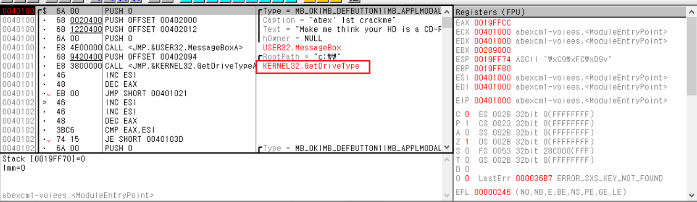

GetDriveType() 함수가 무엇인지 보자.
```
UINT GetDriveTypeA(
  [in, optional] LPCSTR lpRootPathName
);
```
- 드라이브의 루트디렉터리를 전달받은 뒤, 반환 값에 따라 드라이브 유형을 지정함.  
[관련 링크](https://learn.microsoft.com/ko-kr/windows/win32/api/fileapi/nf-fileapi-getdrivetypea)

|반환값|의미|
|-----|-----|
|0|드라이브 유형 확인 불가능|
|1|루트 경로가 잘못됨|
|2|이동식 미디어|
|3|고정 미디어(Hd, 플래시 등)|
|4|네트워크 드라이브|
|5|CD-ROM|
|6|RAM 디스크|

이 문제를 풀기 위해서는 함수 반환 값을 5로 패치해버리면 될 것 같다.   
- `CALL <JMP.&KERNEL32.GetDriveTypeA>` 부터 F8을 눌러가며 확인

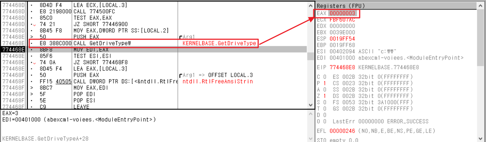
- `CALL GetDriveTypeW` 명령어 실행 후 EAX 값이 3으로 변경됨을 확인
- 계속 진행

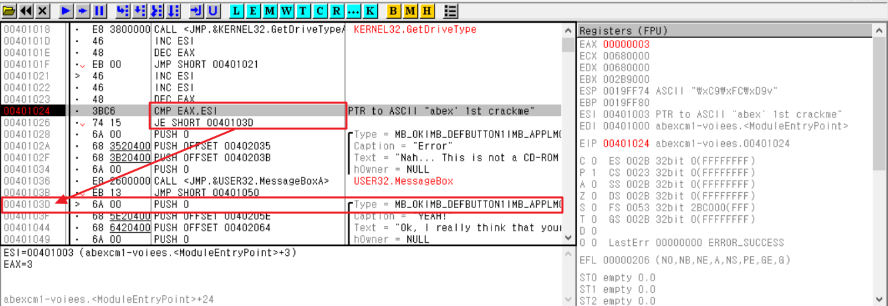
- EAX 값과 ESI를 비교해서 Equal이면 점프.

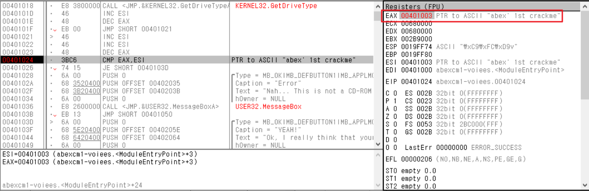
- EAX 값 변경

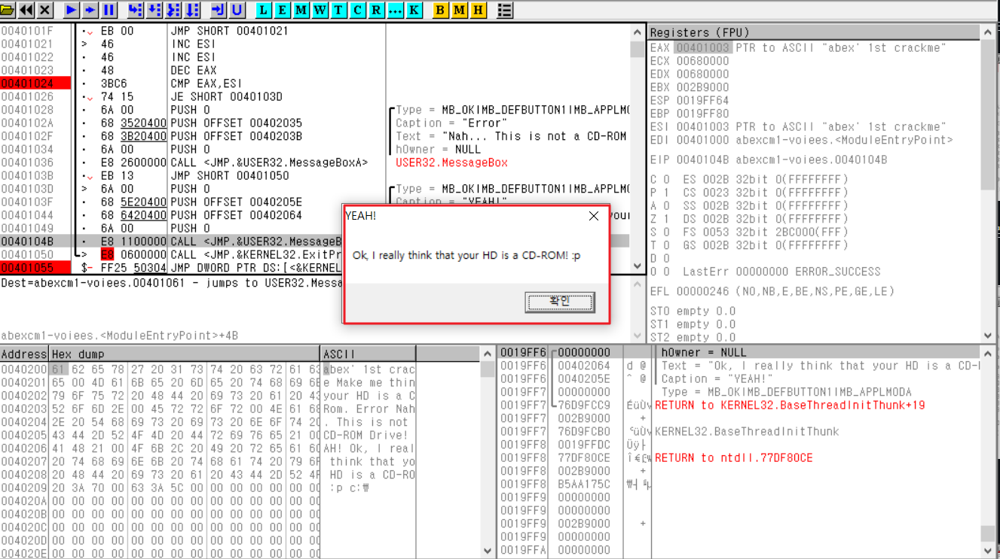
- "your HD is a CO-ROM!" 출력

<br>

### 스택 프레임

스택프레임 어셈블리 구조 
```
PUSH EBP      // 함수의 시작, EBP를 스택에 PUSH (내가 돌아갈곳의 주소가 저장되어있음)
MOV EBP, ESP  //현재 스택포인터 EBP에 저장
...

MOV ESP, EBP  // EBP 값을 ESP에 (=함수 호출 이전의 스택프레임으로 돌아오기 위함)
POP EBP       // 함수 마지막, 스택에서 EBP 값 꺼내서 EBP를 복구함(=함수 호출 이전의 스택 베이스 주소를 갖기위함)
RETN
```

**※ 스택에 복귀주소가 저장될 때, 취약점으로 작용가능함. BUF 통해 복귀주소가 저장된 스택메모리를 다른 값으로 변경 가능하기 때문.**

> `XOR EAX,EAX` : main() 함수의 리턴 값(0) 세팅을 위한 명령어. 같은 값끼리 XOR하면 0이 되는 특징으로, 실행속도가 빨라서 레지스터 초기화 시 많이 사용됨

<br>

### abex' crackme2

- TEST 명령어: 두 오퍼랜드 중 하나가 0이면 ZF = 1로 셋팅  
- JE 명령어: Jump if equal. ZF = 1이면 점프

<br>

### 함수 호출 규약
- cdecl: Caller에서 스택 정리
  - 함수 호출 후 스택 정리 코드가 Caller에 존재함(ADD ESP,8)
- stdcall: Callee에서 스택을 정리
- fastcall: stdcall 방식과 같으나, 함수에 전달하는 파라미터 일부를 스택 메모리가 아닌 레지스터 이용하여 전달함. 빠른 함수 호출 가능.

<br>

### PE File Format
PE 파일: Windows OS에서 사용되는 실행 파일 포맷. 

#### 1. 기본 구조
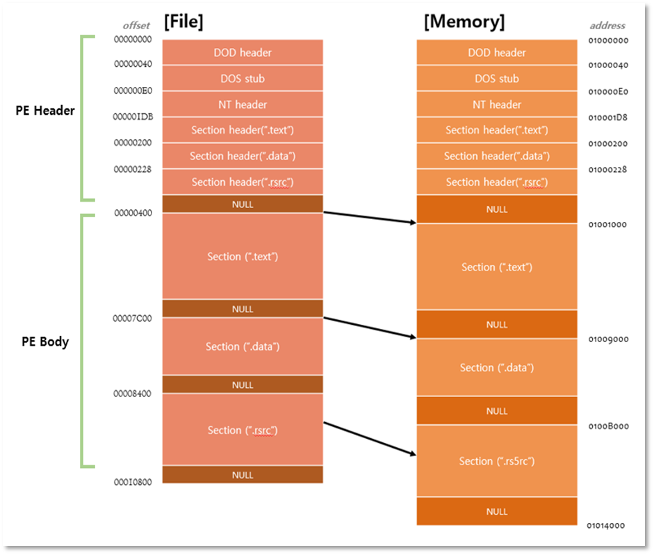
- 파일이 메모리에 적재될 때의 모습 
- PE Header: DOS Header, Section Header
- PE Body: 각 Section Table

파일에서는 위치를 offset으로, 메모리에서는 VA로 표현함.  
\* VA = RVA + ImageBase  
파일의 내용은 보통 코드(.txt), 데이터(.data), 리소스(.rsrc) 섹션에 나뉘어 저장됨.

#### 2. PE Header - DOS Header
DOS 파일에 대한 하위호환성을 제공하기 위한 헤더로, `IMAGE_NT_HEADERS` 구조체 + DOS Stub(선택사항)으로 구성됨.

1\. IMAGE_NT_HEADERS
- 구조체 크기: 40byte
- 주요멤버
  - e_magic: DOS 시그니처( MZ )
  - e_lfanew: NT Header 오프셋. 해당 값이 가리키는 위치에 NT Header 구조체가 위치함

2\. DOS Stub
- 파일을 DOS 환경에서 실행하거나, DOS 전용 디버거를 이용해서 실행시 이 부분의 코드를 실행

#### 3. PE Header - NT Header
NT Header 구조체 `IMAGE_NT_HEADERS`
- 구조체 크기: F8
- 주요멤버
  - Signature: NT 시그니처( PE )
  - FileHeader: 파일의 속성을 나타내는 `IMAGE_FILE_HEADER` 구조체
    - Machine 멤버: CPU 식별값
    - NumberOfSections: 섹션 개수
    - SizeOfOptionalHeader: `IMAGE_OPTIONAL_HEADER32` 구조체의 크기
    - Characteristics: 파일의 속성. exe 파일인지 dll 파일인지, 읽기전용인지 등
  - OptionalHeader: `IMAGE_OPTIONAL_HEADER32` 구조체
    - Magic: 32비트 구조체인경우 10B, 64비트 구조체인경우 20B
    - AddressOfEntryPoint: EP의 RVA
    - ImageBase: PE파일 로딩되는 시작주소
    - SectionAlignment: 메모리에서의 섹션 최소단위
    - FileAlignment: 파일에서의 섹션 최소단위
    - SizeOfImage: PE파일이 로딩되었을 떄 가상메모리 내 PE Image가 차지하는 크기
    - SizeOfHeader: PE 헤더 전체 크기
    - Subsystem: .exe, .dll 구분
    - NumberOfRvaAndSizes: DataDiretory 배열의 개수. PE Loader는 해당 값을 보고 배열 크기 인식
    - **DataDirectory**: `IMAGE_DATA_DIRECTORY` 구조체의 배열


#### 4. PE Header - Section Header
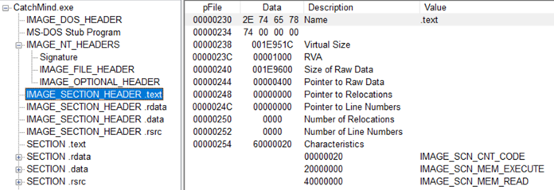
각 섹션의 속성을 정의한 헤더.  
섹션 별 `IMAGE_SECTION_HEADER` 구조체 존재함

- VirtualSize: 메모리에서 섹션이 차지하는 크기
- VirtualAddress: 메모리에서 섹션의 시작 주소(RVA)
- SizeOfRawData: 파일에서 섹션이 차지하는 크기
- PointerToRawData: 파일에서 섹션의 시작 주소
- Characteristics: 섹션 속성

> **※ Section의 역할**
> 섹션은 PE파일이 가상 주소 공간에 로드된 이후.. Code, DATA, resource 등 프로그램 실행에 필요한 정보가 위치하는 영역을 의미한다.
>
> 1) CODE(.text): 프로그램의 실행 코드
> 2) DATA(.data)
> \- data: 전역변수, 정적변수 위치. 읽기 쓰기가 가능한 데이터 섹션
> \- rdata: 상수형 변수, 문자열 상수 등이 위치. 읽기만 가능한 데이터 섹션
> \- bss: 초기화되지 않은 전역변수가 위치
> 3) RESOURCE(.rsrc): icon, cursor 등의 Windows Application Resource 관련 데이터 위치

#### 5. RVA to RAW
파일 오프셋 RAW 찾기(164p)
1. RVA가 속한 섹션 찾기
2. 메모리에서 섹션의 시작 주소 , 파일에서 섹션의 시작 주소 찾기
3. `RAW = RVA - VirtualAddress + PointerToRawData` 계산

<br>

### IAT
IAT: Import Address Table
PE파일이 Import하는 함수의 시작주소가 담긴 테이블

#### 1. IMAGE_IMPORT_DESCRIPTOR
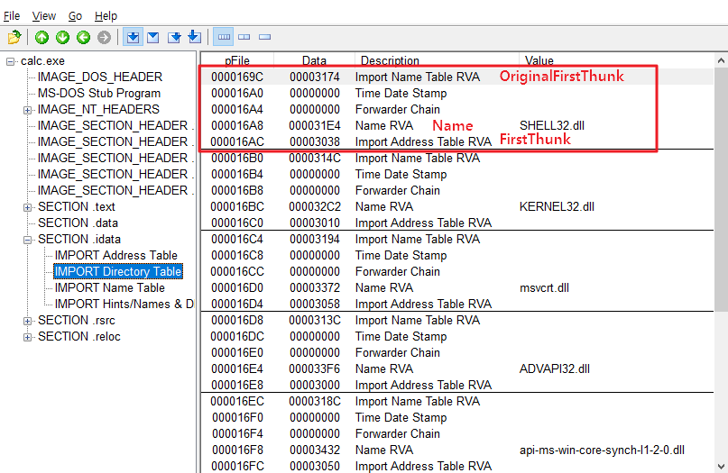
IMAGE_IMPORT_DESCRIPTOR는 
PE 파일이 Import하고 있는 라이브러리를 명시한 구조체 
PE 로더는 Import 함수 주소를 IID를 참조하여 IAT에 입력한다.

- OriginalFirstThunk: INT 주소
- Name: 라이브러리 문자열 주소
- FirstThunk: IAT 주소

<br>

#### 2. calc.exe 실습
책에서는 HxD로 하나하나 확인했으나, 나는 PEView보며 RVA to RAW만 확인해봄

**1. IMPORT Directory Table을 찾기 위해 DataDirectory[1].VirtualAddress 값 확인**
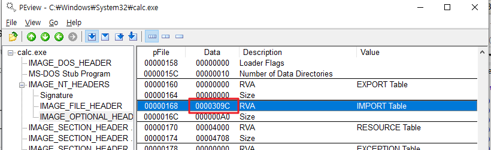
- RVA = 0000309C

**2. 오프셋 계산**
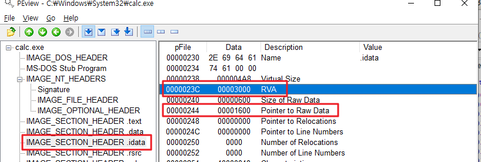
- RVA가 속한 섹션: .idata
- VirtualAddress: 3000, PointerToRawData: 1600
- File Offset = 0000309C - 3000 + 1600 = **169C**

**3. IMAGE_IMPORT_DESCRIPTOR(IMPORT DIRECORY TABLE) 시작 위치 확인**
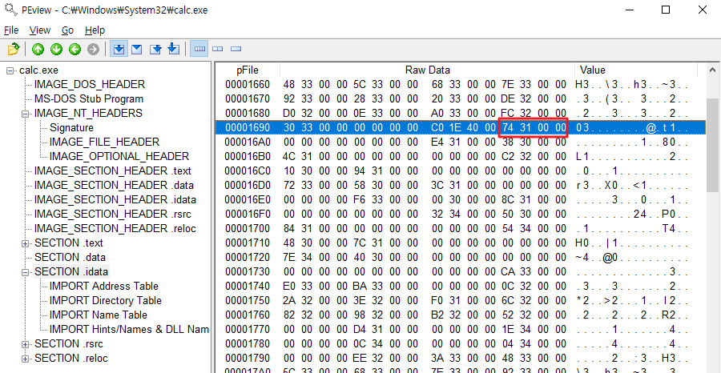
- SECTION .idata에서 169C 위치부터 IID 존재함
  
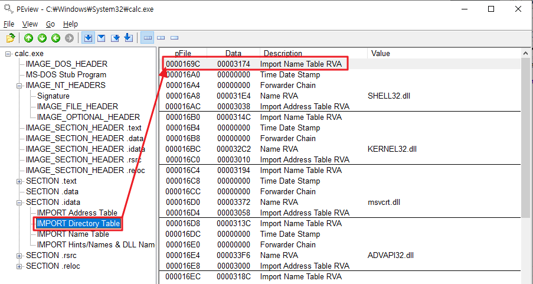
- IMPORT Directory Table 첫 줄에 169C 오프셋 확인가능

**4. IMAGE_IMPORT_DESCRIPTOR 멤버**

|file offset|멤버|RVA|RAW|
|-|-|-|-|
|169C|OrgnalFirstThunk(INT)|00003174|00001774|
|16A0|TimeDateStamp|00000000|00000000|
|16A4|ForwarderChain|00000000|00000000|
|16A8|Name|000031E4|000017E4|
|16AC|FirstThunk(IAT)|00003038|00001638|

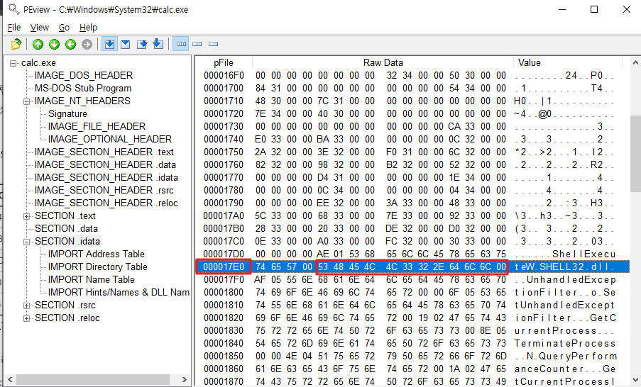
- 실제로 000017E4에 Name인 `SHELL32.dll`이 존재하는 것을 알 수 있음

<br>

### EAT
EAT: Export Address Table. 라이브러리에서 Export하는 함수의 시작주소가 담긴 테이블

#### 1. IMAGE_EXPORT_DIRECTORY
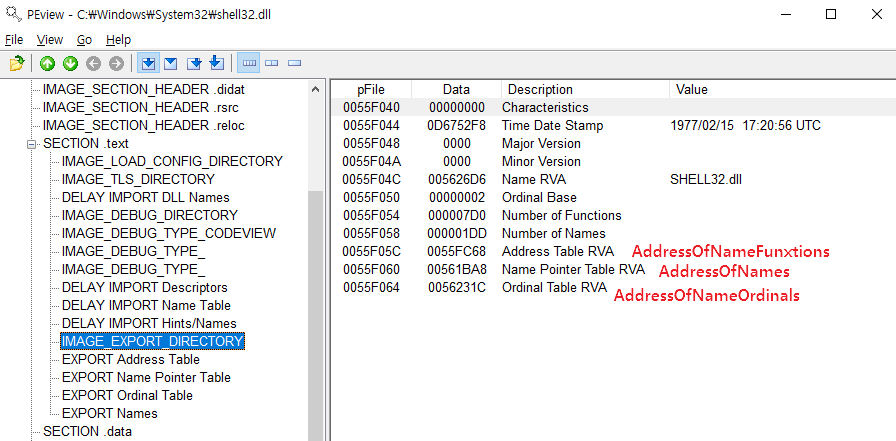
PE 파일이 어떤 라이브러리를 export 하고 있는지 명시한 구조체.  
PE 로더가 PE 파일을 메모리에 로딩할 때, EAT에 기록된 API 이름을 참조함.

- NumberOfFunctions: 실제 Export할 함수 개수
- NumberOfNames: Export 함수 중 이름을 가지는 함수 개수
- **AddressOfFunctions**: Export 함수 주소 배열
- AddressOfNames: 함수 이름 주소 배열
- AddressOfNameOrdinals: Ordinal 배열

라이브러리에서 함수 주소를 얻는 APT인 `GetProcAddress()` 통해 EAT를 참조해서 API 주소를 구한다.

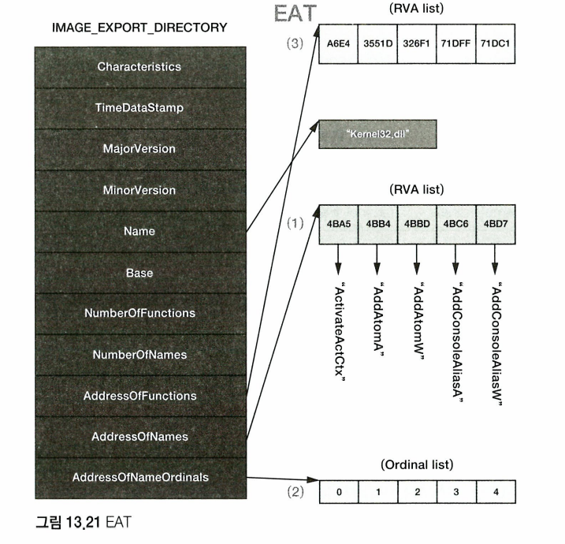

**[함수시작주소 찾는 과정]**
→ GetProcAddress('함수명') 사용 > AddressOfNames 멤버 통해 함수 이름 배열에서 함수명 찾기 > AddressOfNameOrdinals 멤버 통해 ordinal 배열에서 ordinal 값 찾기 > AddressOfFunctions 멤버 통해 함수 주소 배열(EAT) 이동 후 ordinal을 인덱스로하여 함수 시작주소 획득

<br>

#### 2. 원하는 함수명 찾기 (shell32.dll)
책에서는 HxD로 하나하나 확인했으나, 나는 PEView보며 RVA to RAW만 확인해봄

**1. GetProcAddress('Control_RunDLL')**
`Control_RunDLL` 함수의 시작주소를 찾기 위해 `AddressOfNames` 멤버에 접근한다.
- 멤버의 RVA = 561BA8
- RAW = 00560FA8
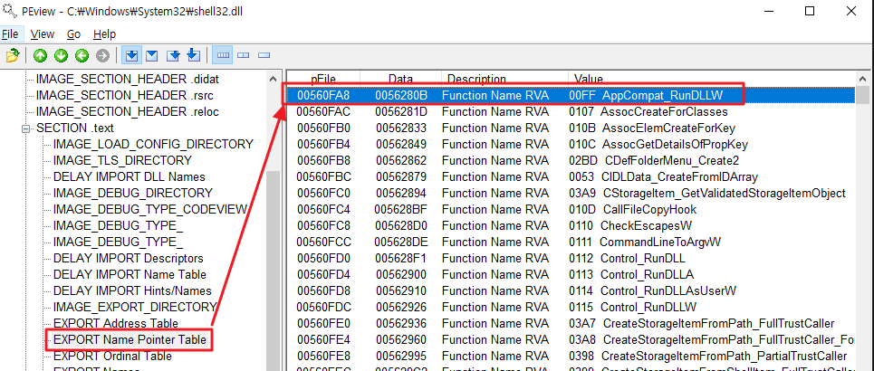

**2. 함수명 찾기**
EXPORT Name Pointer Table의 시작주소가 맞다. 이곳에서 `Control_RunDLL` 함수명을 찾는다.  
배열 인덱스는 0112
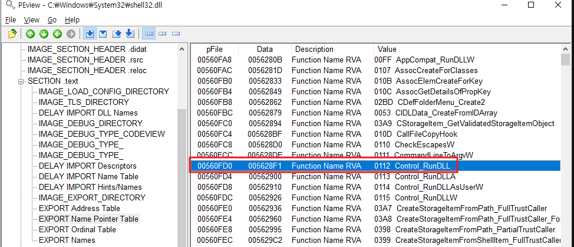

**3. Ordinal 배열**
`Control_RunDLL` 함수의 Ordinal 값을 알아내기 위해 `AddressOfNameOrdinals` 멤버에 접근한다.
- 멤버의 RVA = 0056231C
- RAW = 0056171C
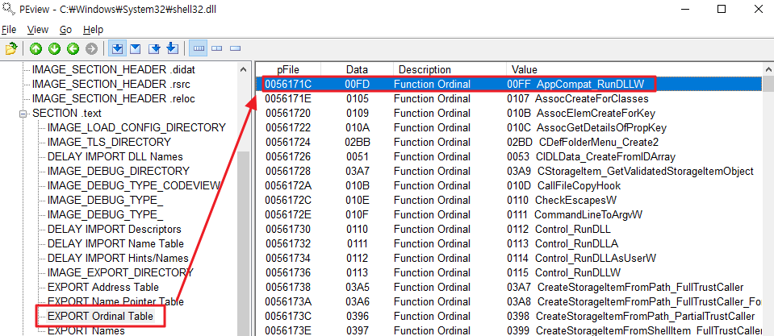

**4. ordinal**
인덱스 값 0112을 배열에 적용하면 Ordinal(10)을 구할 수 있다. 
- AddressOfNameOrdinals[index] = ordinal (index = 0112, ordinal = 0112)
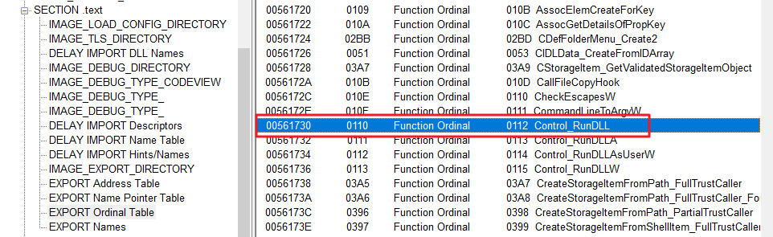

**5. EAT에서 함수 시작주소 찾기**
ordinal을 인덱스로 함수 시작주소를 찾자. IMAGE_EXPORT_DIRECTORY에서 `AddressOfFunctions` 멤버 주소 확인 후 접근
- 멤버의 RVA = 0055FC68
- RAW = 0055F068
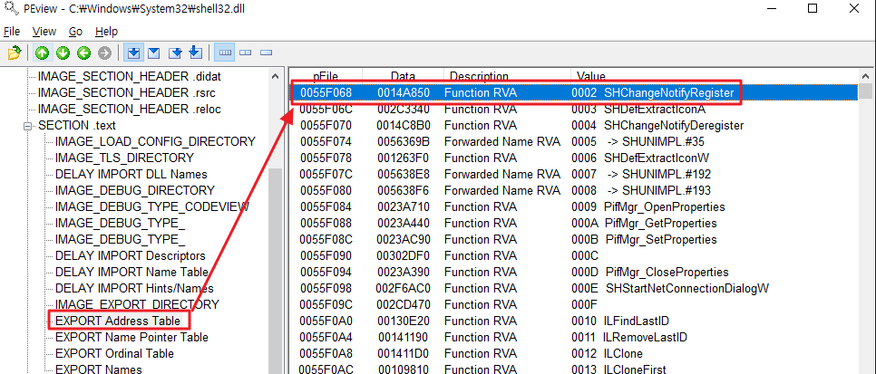

**6. `Control_RunDLL` 함수 주소**
- AddressOfFunction[ordinal] = RVA (ordinal = 0112, RVA = 002A19E0)
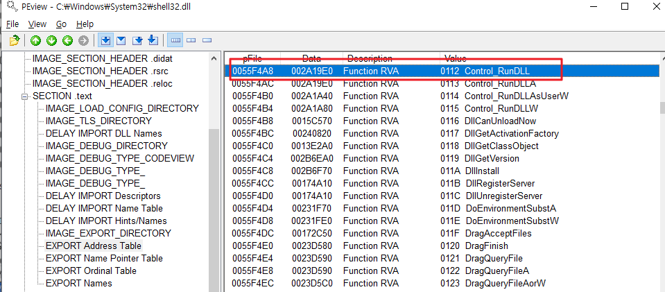

