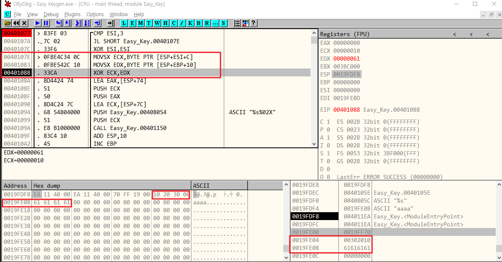

# 문제풀이 과제
- [x] Dreamhack - basic-rev2
- [x] reversing\.kr - Easy ELF
- [x] reversing\.kr - Easy keygen


## 1. Dreamhack - basic-rev2


- 조건문은 sub_140001000()함수 반환값이 참이어야 함. 진입


- for문 : 18번 루프를 돌고 있음. ac[4*i] 와 매개변수 a1를 비교
- 만약 틀리면 0을 반환
- ac[]를 확인해보면 'Comp4re_the_arr4y' 문자열이 저장되어 있으며, 4*i 해주는 이유는 4byte 단위로 저장되어 있기 때문으로 추측됨

<br>

## 2. reversing\.kr - Easy ELF


- scanf 함수를 보면, 입력값이 &DAT_0804a020 위치에 저장됨
- FUN_08048451() 함수 내부에서 scanf로 입력받은 위치를 검사하고 있음.


**[조건]**
- DAT_0804a020 == 0x78
- DAT_0804a021 == '1'
- DAT_0804a022 == 0x7c
- DAT_0804a023 == 0xdd
- DAT_0804a024 == 'X'
- DAT_0804a025 == '\0'

각 값에 xor 해주면 되겠다.

```
# input 값을 구하기
result = [0x78, '1', 0x7c, 0xdd, 'X', '\0']
input = []

input.append(result[0] ^ 0x34)
input.append(ord(result[1]))
input.append(result[2] ^ 0x32)
input.append(result[3] ^ 0x88)
input.append(ord(result[4]))  

input2ascii = ''.join(chr(i) for i in input)

print(input2ascii)
```

=> L1NUX

<br>

## 3. reversing\.kr - Easy Keygen
문제가 abex' carackme2랑 비슷한 것 같다.  
readme.txt 파일을 읽어보면 `Find the Name when the Serial is 5B134977135E7D13` 확인 가능함.  

**Try 1.**
name에 'test' 입력했을 때, 동적분석으로 확인가능한 serial 은 '64454364'이다.
name에 따라 serial이 계산되는 듯. 공식을 찾아봐야 할 것 같다.

**Try 2.**
name에 'aaaa' 입력, serial은 '71415171'
계산 루프를 확인해보자.


확인해야 할 곳은 이곳이다. 
- `MOVSX ECX,BYTE PTR [ESP+ESI+C]` : ESP는 0019FDF8, ESI는 0, C를 더한 스택 위치에 302010이 저장되어 있다. 
- `MOVSX EDX,BYTE PTR [ESP+EBP+10]` : ESP는 0019FDF8, EBP는 0, 10을 더한 스택 위치에 61616161 저장되어 있다. 즉 내가 입력한 값을 가리키는 포인터. 이를 BYTE 크기만음 EDX에 넣는다. 첫 글자인 61이 들어간다.

> loop 1: 0x61 ^ 0x10 = 0x71
> loop 2: 0x61 ^ 0x20 = 0x41
> loop 3: 0x61 ^ 0x30 = 0x51
> loop 4: 0x61 ^ 0x10 = 0x71

해서 serial은 714151이더라.

그럼 serial `5B134977135E7D13` 를 만들기 위해서 코드를 짜보자

```
# 주어진 serial 문자열
serial = '5B134977135E7D13'

serial2hex = [serial[i:i+2] for i in range(0, len(serial), 2)]
serial2hex2int = [int(pair, 16) for pair in serial2hex]
xor = [0x10, 0x20, 0x30]

result = [i ^ xor[j % len(xor)] for j, i in enumerate(serial2hex2int)]

result2ascii = ''.join(chr(i) for i in result)

print(result2ascii)

```
=> K3yg3nm3


