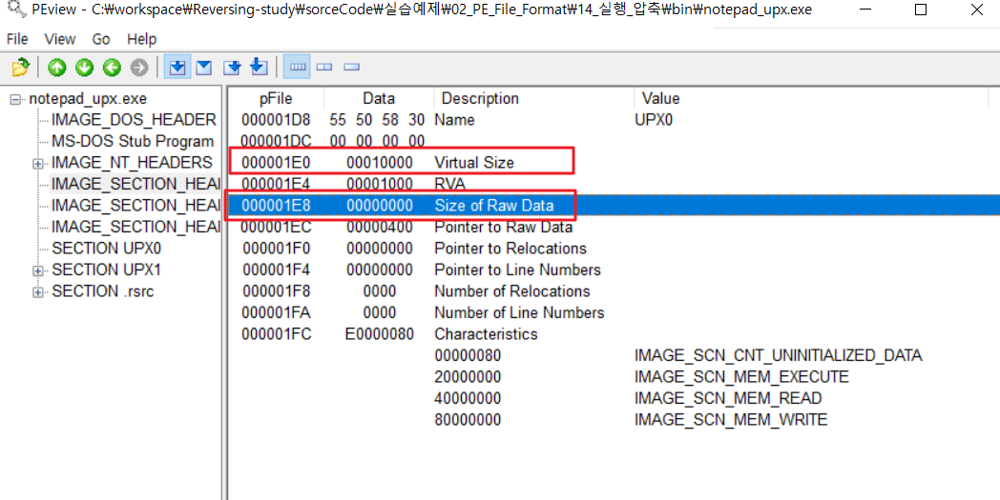

# WEEK 3
- [x]  드림핵
  - 기드라 과정: 디버거 이슈 해결
- [x]  도서 ‘리버싱 핵심원리’ - 2부
- [x]  문제풀이 과제
  - reversing\.kr - Easy Unpack
  - dreamhack- SimpleCrackMe, Small Counter
  - 나머지는 개인적으로 진행

 

## 리버싱 핵심원리
### 실행 압축
실행 압축
- PE 파일을 대상으로 파일 내부에 압축해제 코드를 포함
- 코드 실행 순간 메모리에서 압축해제 후 실행

패커: PE 파일 전문 압축기
- 평범한 PE파일을 만드는 UPX, ASPack 등
- 불순한 의도를 가진 UPACK, PESpin, NSAnti 등

PE 프로텍터
- PE파일을 리버싱으로부터 보호하는 유틸리티. 실행압축 + 안티디버깅 + 안티에뮬레이팅 + 코드난독화 ....
- 크래킹 방지, 코드 및 리소스 보호 목적
- 게임 보안 프로그램 등에 적용(해킹툴 실행방지)

### 실습
upx 툴을 이용하여 notepad.exe 실행압축 > PEView.exe로 확인

첫 번째 섹션 헤더 UPX0의 `SizeofRawData(파일에서 섹션이 차지하는 크기)`가 0이다. 이유는 UPX로 실행압축된 파일은 실행시 압축된 코드를 첫번째 섹션에 풀기 때문.  
**→ 압축해제 코드, 압축된 원본 코드는 두번째 섹션에 위치함**  
**→ 파일 실행 > 압축해제코드 실행 > 압축된 원본을 첫번째 섹션에 압축해제시킴 > 원본 EP코드 실행**

