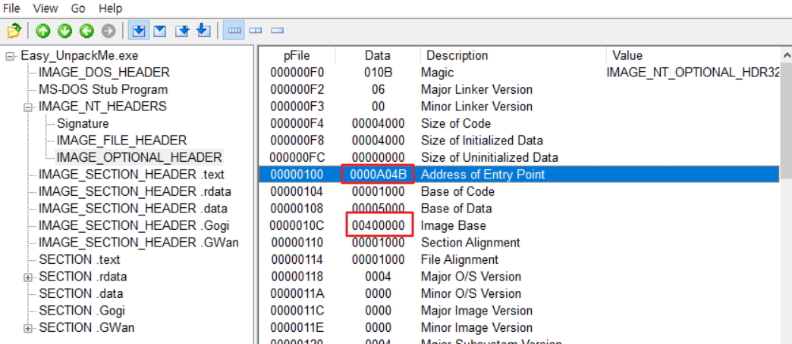
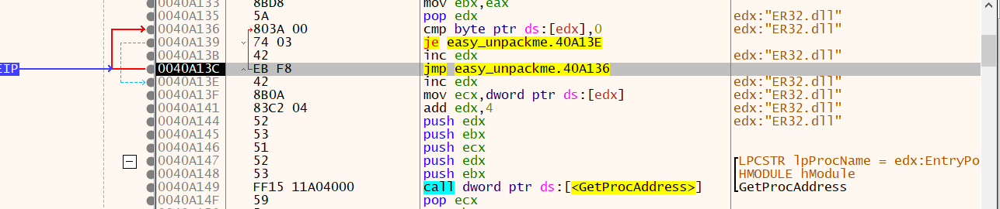

# WEEK 3 

과제
- [x] reversing\.kr - Easy Unpack
- [x] Dreamhack - Simple Crack Me
- [x] Dreamhack - Small Counter

과제 외
- [x] Dreamhack - rev-basic-4
- [x] Dreamhack - rev-basic-6
- [x] Dreamhack - rev-basic-8

 

## reversing\.kr - Easy Unpack

todo: Find the OEP
- OEP: Orignal Entry Point

현재 EP: 0040A04B

이는 PEView의 IMAGE_OPTIONAL_HEADER 통해서도 확인 가능하다

- EP는 0000A04B
- Image Base는 00400000     
   → 0040A04B
- 주소가 .GWan 섹션에 위치함(섹션헤더 확인)

아무튼 EP부터 쭉 실행해보며 jmp, call 명령어 부분을 유심히 볼 것

- 처음 만난 jmp 명령어. OEP로 점프하는 것 같지는 않음. 탈출

- GetProcAddress(), VirtualProtect() Call. 패커가 주로 사용하는 함수. 넘김
- 그 아래에 있는 LoadLivraryA() Call도 넘김

- byte단위로 무언가 비교하고 있음. dll 이름인 듯
- 여기 jmp 명령어 탈출, 그 아래 GetProcAddress()도 넘김

- 비교 후 결과에 따라 루프가 진행되고 있는 부분
- 아래 jmp문 2개 존재하며, `40A1D1`은 루프의 첫부분으로 점프
- `401150` 은 루프종료 후 점프하는 주소로, 지금까지 확인된 `40A---` 주소랑은 다른 영역으로 추정됨

- PEView로 섹션헤더 확인
- .text 영역의 VirtualAddress(RVA)가 00001000이다.

- `401150` 주소로 점프
- 여기서 느낌이왔다. 쭉 내리다보면 `401219` 주소에서 프로그램이 실행됨을 확인 가능

여기까지의 과정을 통해 OEP가 401150이라고 추측함. 근데 맞게한건지 잘 모르겠다. 다른 사람의 풀이도 확인해봐야 할 듯

> OEP 찾기 편법: https://hansu1512.tistory.com/3

 

## dreamhack - simple crack me

저작권문제로 [dreamhack 풀이](https://dreamhack.io/wargame/writeups/19898)에 작성함

 

## Dreamhack - Small Counter

todo: flag_gen() 함수 실행하기

저작권문제로 [dreamhack 풀이](https://dreamhack.io/wargame/writeups/19897)에 작성함

 

## Dreamhack - rev-basic-4
저작권문제로 [dreamhack 풀이](https://dreamhack.io/wargame/writeups/19925)에 작성함

 

## Dreamhack - rev-basic-6
저작권문제로 [dreamhack 풀이](https://dreamhack.io/wargame/writeups/19936)에 작성함

 

## Dreamhack - rev-basic-8
저작권문제로 [dreamhack 풀이](https://dreamhack.io/wargame/writeups/19956)에 작성함