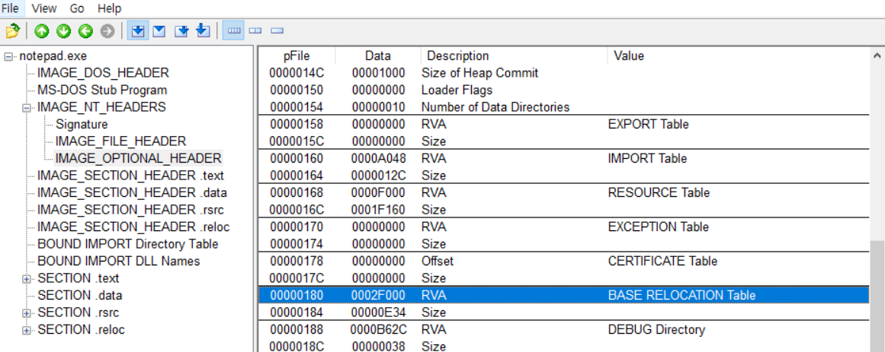
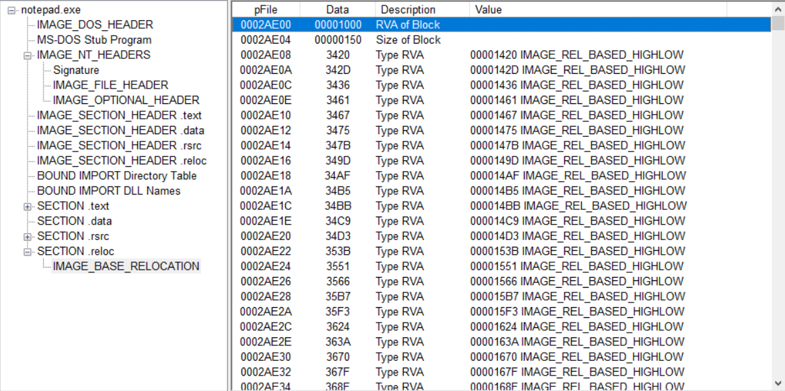

# WEEK 3
- [ ]  도서 ‘리버싱 핵심원리’ - 2부
  - 16~20장 목표
- [ ]  문제풀이 과제 대기중

 

## 리버싱 핵심원리

## PE 재배치
PE 파일이 ImageBase에 로딩되지 못하고 다른 주소에 로딩될 떄 수행되는 작업을 의미

1) 프로그램에서 하드코딩된 주소 위치 찾기
2) 값을 읽을 후 ImageBase만큼 빼기 (VA → RVA)
3) 실제 로딩주소 더하기 (RVA → VA)

하드코딩된 주소 위치를 찾기 위해 Relocation Table이라는 하드코딩 주소들의 오프셋을 모아둔 테이블을 찾는다.

PE헤더의 Base Relocation Table 항목을 따라가서 Relocation Table을 찾을 수 있다. 

- IMAGE_OPTIONAL_HEADER의 Data Directory[5]
- 주소는 2F000, RVA는 2F000-2F000+2AE00 = 2AE00
  - 그냥 복습삼아 계산해봤다

- VirtualAddress: 1000
- SizeOFBloack: 150
- TypeOffset: 2byte값을 가지며, Type 4bit, OFfset 12bit로 나뉨
  - TypeOffset 3420: Type 3, Offset 420
  - TYpe: PE파일에서 일반적으로 3, 64bit용 PE+는 4를 가짐
  - 하위 12bit가 진짜 Offset임.

해당 Offset은 VirtualAddress 기준임.

이를 기준으로 하드코딩 주소가 있는 오프셋 계산

→ VirtualAddress + Offset = 1000 + 420 = 1420(RVA)

실제로 해당 주소에 하드코딩된 주소가 있을까?
